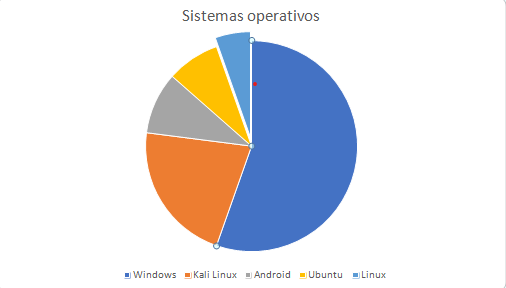

# Apuntes: Sistemas Operativos Actuales

Descripción general de los sistemas operativos actuales en concreto Linux, Ubuntu, kali-linux, Windows y Android

## 1. Linux

- Descripción:
    - Sistema operativo de código abierto basado en Unix, diseñado para ser altamente personalizable, seguro y eficiente.

- Es un núcleo (kernel) que da origen a múltiples distribuciones.

- Características principales:
    - Estabilidad y rendimiento para servidores y estaciones de trabajo.
	- Alta compatibilidad con sistemas embebidos y desarrollos personalizados.
	- Comunidad activa de desarrolladores.
	- Distribuciones populares:
	- Ubuntu
	- Debian
	- Fedora
	- Arch Linux
________________________________________

## 2. Ubuntu (Distribución de Linux)

- Descripción:
    - Basada en Debian, Ubuntu es una de las distribuciones más populares de Linux, conocida por su facilidad de uso y soporte comunitario.

- Características principales:
    - Facilidad de instalación: Ideal para principiantes en Linux.
    - Entorno gráfico: Usa GNOME por defecto, aunque soporta otros escritorios como KDE (Kubuntu).
    - Versiones LTS: Soporte a largo plazo (Long Term Support) de 5 años. Ejemplo: Ubuntu 24.04 LTS.
    - Aplicaciones preinstaladas: Incluye LibreOffice, Firefox, y herramientas de desarrollo.
    - Usos comunes: Servidores, estaciones de trabajo, desarrollo de software y uso personal.
________________________________________

## 3. Kali Linux (Distribución de Linux)

- Descripción:
    - Distribución basada en Debian diseñada específicamente para pruebas de penetración y seguridad informática.

- Características principales:
    - Herramientas integradas: Incluye más de 600 herramientas de hacking ético, análisis forense, y auditoría de seguridad.
    - Interfaz gráfica: Utiliza entornos como XFCE para ser ligera y rápida.
    - Modo Live: Permite ejecutarse desde un USB sin necesidad de instalación.
    - Uso común: Pentesters, analistas de seguridad, y estudiantes de ciberseguridad.

Nota: No se recomienda para usuarios generales debido a su enfoque técnico.
________________________________________

## 4. Windows

- Descripción:
    - Sistema operativo propietario desarrollado por Microsoft, líder en el mercado de computadoras personales.
    - Última versión: Windows 11.

    - Características principales:
        - Interfaz gráfica intuitiva: Basada en ventanas (GUI) para facilitar la experiencia de usuario.
        - Compatibilidad de software: Compatible con la mayoría de aplicaciones comerciales y videojuegos.
        - Actualizaciones continuas: Integración con servicios en la nube como OneDrive y Windows Update.
        - Ediciones disponibles: Hogar, Profesional, y Enterprise (orientada a empresas).
        - Uso común: Computadoras personales, empresas, estaciones de trabajo, y gaming.
________________________________________

## 5. Android
- Descripción:
    - Sistema operativo basado en el núcleo Linux, diseñado por Google para dispositivos móviles como smartphones y tablets.

- Características principales:
    - Código abierto: Permite a fabricantes como Samsung, Xiaomi, y Huawei personalizarlo según sus necesidades.
    - Google Play Store: Tienda de aplicaciones con millones de opciones.
    - Compatibilidad: Incluye soporte para apps de productividad, juegos y dispositivos IoT.
    - Fragmentación: Diferentes versiones en circulación según el fabricante. Última versión: Android 14.
    - Usos comunes: Smartphones, tablets, smart TVs, y dispositivos IoT.

| Sistemas Operativos | Enfoque | Ventajas | Desventajas |
|---------------|---------------|---------------|-----------|
| Linux | General, personalizable | Seguro, código abierto, eficiente  | Curva de aprendizaje inicial |
| Ubuntu  | Uso General /Servidores | Fácil de usar, soporte comunitario  | Menor compatibilidad que Windows |
| Kali-Linux  | FCiberseguridad  | Especializado, herramientas de pentesting | No apto para uso general |
| Windows  | Uso General / Gaming  | Interfaz intuitiva, software comercial | Propietario, vulnerable a Malware |
| Android | Moviles y loT | Personalizable, apps accesibles | Fragmentacion entre versiones |

