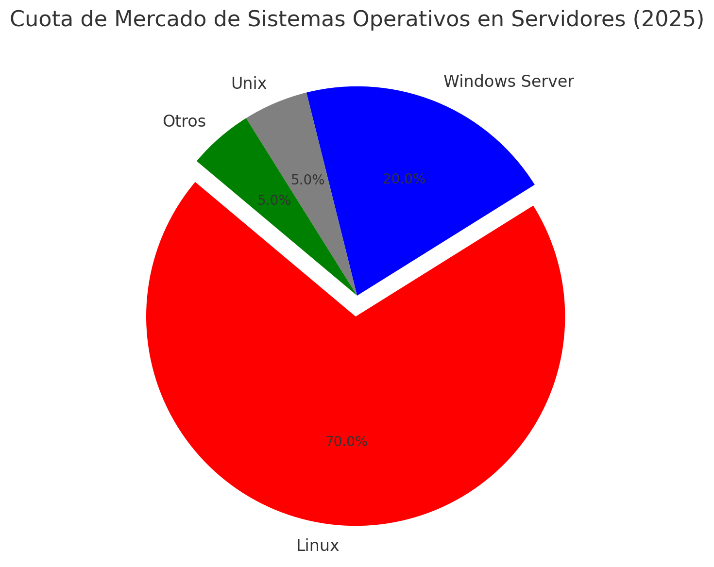
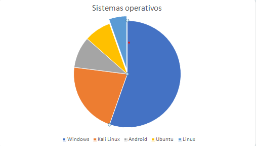

<<<<<<< HEAD
# Apuntes: Sistemas Operativos Actuales

Descripción general de los sistemas operativos actuales en concreto Linux, Ubuntu, kali-linux, Windows y macOS

## 1. Linux

- Descripción:
    - Es un sistema operativo de código abierto basado en Unix, diseñado para ser altamente personalizable, seguro y eficiente.
    - Unix es la base fundamental para muchos sistemas operativos modernos, incluyendo Linux y macOS, se caracteriza por su estabilidad y uso en servidores y entornos empresariales.
    - Fedora es una distribución de Linux patrocinada por Red Hat, conocida por integrar tecnologías innovadoras antes de ser implementadas en RHEL.
    - RHEL (Red Hat Enterprise Linux) es la versión empresarial de Linux, enfocada en estabilidad y soporte a largo plazo, utilizada en corporaciones y gobiernos.

- Características principales:
    - Núcleo (Kernel): Linux es el kernel que da origen a múltiples distribuciones.
    - Estabilidad y rendimiento: Ideal para servidores y estaciones de trabajo.
    - Alta compatibilidad: Se usa en sistemas embebidos, IoT, supercomputadoras y dispositivos personalizados.
    - Comunidad activa: Miles de desarrolladores y empresas contribuyen a su evolución.
    - Distribuciones populares:
    - Ubuntu: Fácil de usar, ideal para principiantes y servidores.
    - Debian: Base sólida y estable para muchas otras distribuciones.
    - Fedora: Innovadora y vanguardista, patrocinada por Red Hat.
    - Arch Linux: Altamente personalizable y optimizada para usuarios avanzados.

- Usos comunes:
    - Servidores web, bases de datos, y hosting.
    - Desarrollo de software y administración de sistemas.
    - Seguridad informática y análisis forense.
    - Computación en la nube (AWS, Google Cloud, Azure).
________________________________________

## 2. Ubuntu (Distribución de Linux)

- Descripción:
    - Esta basado en Debian, Ubuntu es una de las distribuciones más populares de Linux, conocida por su facilidad de uso y amplio soporte comunitario.
    - Desarrollada por Canonical, Ubuntu ofrece versiones tanto para usuarios domésticos como empresariales.

- Características principales:
    - Facilidad de instalación: Diseñada para ser accesible a principiantes.
    - Entorno gráfico: Usa GNOME por defecto, aunque soporta escritorios alternativos como KDE (Kubuntu), Xfce (Xubuntu) y MATE (Ubuntu MATE).
    - Versiones LTS (Long Term Support):
    - Ofrece 5 años de soporte en versiones estables.

- Seguridad y actualizaciones:
    - Se actualiza regularmente con parches de seguridad.
    - Compatible con herramientas como AppArmor y UFW (Uncomplicated Firewall).

- Aplicaciones preinstaladas:
    - LibreOffice: Alternativa gratuita a Microsoft Office.
    - Firefox: Navegador web predeterminado.
    - GIMP, VLC y Thunderbird: Herramientas multimedia y de correo.

- Usos comunes:
    - Servidores y Cloud Computing: Amplia adopción en plataformas como AWS, Google Cloud y Azure.
    - Desarrollo de software: Compatible con Python, Java, C++, Docker y Kubernetes.
    - Educación y estaciones de trabajo: Preferido en universidades y empresas tecnológicas.
    - Uso personal: Alternativa gratuita y libre a Windows y macOS.
________________________________________

## 3. Kali Linux (Distribución de Linux)

- Descripción:
    - Es una distribución basada en Debian, diseñada específicamente para pruebas de penetración y seguridad informática.
    - Esta desarrollada por Offensive Security, Kali Linux es utilizada por pentesters, analistas de seguridad y forenses digitales.

- Características principales:
    - Herramientas integradas:
        - Incluye más de 600 herramientas de hacking ético, análisis forense y auditoría de seguridad.
        - Destacan Nmap, Metasploit, Wireshark, Aircrack-ng y John the Ripper.
    - Interfaz gráfica optimizada:
        - Usa entornos ligeros como XFCE, permitiendo un rendimiento ágil en hardware limitado.
        - También soporta KDE y GNOME para configuraciones avanzadas.
    - Modo Live:
        - Se puede ejecutar directamente desde un USB sin necesidad de instalación.
        - Útil para auditorías rápidas sin afectar el sistema anfitrión.
    - Soporte para ARM y dispositivos móviles:
        - Disponible para Raspberry Pi, Android (NetHunter) y sistemas embebidos.
    - Seguridad avanzada:
        - Ejecuta a los usuarios en modo no-root por defecto para reducir riesgos.
        - Puede personalizarse con herramientas adicionales según las necesidades del usuario.

- Uso común:
    - Pentesting y auditorías de seguridad: Pruebas de vulnerabilidades en redes y sistemas.
    - Análisis forense digital: Investigación de incidentes de seguridad.
    - Entrenamiento y aprendizaje: Formación en ciberseguridad y hacking ético.
________________________________________

## 4. Windows

- Descripción:
    - Su Sistema operativo esta desarrollado por Microsoft, líder en el mercado de computadoras personales.
    - Última versión: Windows 11 (con actualizaciones periódicas y soporte extendido).

- Características principales:
    - Interfaz gráfica intuitiva: Basada en ventanas (GUI - Graphical User Interface) para facilitar la experiencia del usuario.
    - Compatibilidad de software: Soporte para una gran variedad de aplicaciones comerciales, herramientas de productividad y videojuegos.
    - Actualizaciones y seguridad:
    - Windows Update: Proporciona actualizaciones automáticas de seguridad y nuevas funciones.
    - Windows Defender: Antivirus integrado con protección en tiempo real.
    - BitLocker: Cifrado de disco completo en ediciones Pro y Enterprise.

- Ediciones disponibles:
    - Windows 11 Home: Orientado a usuarios domésticos.
    - Windows 11 Pro: Funciones avanzadas para profesionales y empresas.
    - Windows 11 Enterprise: Seguridad y administración a gran escala para corporaciones.

- Uso común:
    - Computadoras personales.
    - Empresas y entornos corporativos.
    - Estaciones de trabajo profesionales.
    - Gaming: Amplia compatibilidad con DirectX y optimización para hardware de juegos.
    - Integración con la nube:
    - OneDrive: Sincronización de archivos en la nube.
    - Microsoft 365: Suite de productividad con Word, Excel, y Outlook.
    - Azure AD: Autenticación y gestión de identidades empresariales.
    - Compatibilidad con hardware: Soporta una amplia gama de dispositivos, desde PCs de bajo costo hasta estaciones de alto rendimiento.
________________________________________

## 5. MacOs

- Descripción:
    - Su sistema operativo esta desarrollado por Apple Inc.
    - Última versión: macOS Sonoma (2023).
    - Diseñado para funcionar exclusivamente en hardware Apple (MacBook, iMac, Mac Mini, Mac Studio, Mac Pro).
    - Características principales:
    - Interfaz elegante y fluida: Diseño intuitivo basado en el concepto de escritorio con Dock y Mission Control.
    - Optimización con hardware Apple:
    - Integración con chips Apple Silicon (M1, M2, M3) para mayor eficiencia y rendimiento.
    - Menor consumo de energía y mayor duración de batería en MacBooks.

- Seguridad avanzada:
    - FileVault: Cifrado de disco completo.
    - Gatekeeper: Controla la instalación de aplicaciones solo desde fuentes verificadas.
    - XProtect: Protección contra malware integrada.
    - Ediciones y dispositivos compatibles:
    - macOS estándar para todos los dispositivos Mac.
    - Compatible con modelos recientes y algunos anteriores con actualizaciones.
    - Ecosistema Apple:
    - Handoff, Continuity y AirDrop: Conexión fluida con iPhone, iPad y Apple Watch.
    - iCloud: Sincronización automática de archivos, fotos y configuraciones.
    - Sidecar: Usa un iPad como pantalla secundaria para Mac.

- Uso común:
    - Profesionales del diseño, edición de video y desarrollo de software.
    - Empresas que usan dispositivos Apple.
    - Usuarios que buscan estabilidad y larga vida útil en sus equipos.
    - Compatibilidad con software:
    - Soporte nativo para aplicaciones macOS (Final Cut Pro, Logic Pro, Xcode).
    - Rosetta 2: Permite ejecutar aplicaciones diseñadas para procesadores Intel en chips Apple Silicon.
    - Virtualización: Se puede instalar Windows o Linux mediante Parallels, VMware o Boot Camp (solo en Macs Intel).
________________________________________

## 6. Cuota de Market Share de Servidores

###### Gráfico que representa el marketshare de los sistemas operativos mencionados
- Linux: Dominante en servidores, con una cuota de mercado superior al 70%, especialmente en servidores web y en la nube.
- Windows Server: Aproximadamente 20%, usado en entornos empresariales con integración de herramientas Microsoft.
- Unix: Menos del 5%, pero sigue presente en sectores críticos como banca y telecomunicaciones.
________________________________________

## 7. Gestión de Identidad y Acceso (IAM - Identity and Access Management) en Diferentes Sistemas Operativos

- Es crucial para garantizar la seguridad en sistemas operativos, cada plataforma tiene su propio enfoque para administrar autenticación, autorización y control de acceso.

- Linux/Unix
    - En entornos Linux y Unix, la IAM se maneja con una combinación de herramientas y protocolos:

    - LDAP (Lightweight Directory Access Protocol)

        - Protocolo estándar para la autenticación centralizada en redes empresariales.
        - Se usa para almacenar credenciales y permisos de usuarios.
        - Integración con OpenLDAP y Active Directory (AD).
        - PAM (Pluggable Authentication Modules)

    - Framework modular que permite autenticación flexible.
        - Soporta autenticación mediante contraseña, biometría, tarjetas inteligentes, etc.
        - Utilizado por SSH, sudo y otros servicios críticos.
        - Active Directory (AD)

    - Aunque es una tecnología de Microsoft, se puede integrar con Linux usando Samba o SSSD (System Security Services Daemon).
        - Permite a los servidores Linux autenticarse en dominios Windows.
        - Kerberos

    - Protocolo de autenticación de red que permite autenticación única (SSO).
        - Utilizado en muchas implementaciones empresariales de IAM.

- Windows
    - Windows tiene un enfoque unificado para IAM, centrado en Active Directory (AD):

    - Active Directory (AD)

        - Base de datos jerárquica para la autenticación y autorización en redes Windows.
        - Soporta políticas de acceso, administración de grupos y control centralizado de usuarios.
        - Utiliza LDAP, Kerberos y NTLM como protocolos de autenticación.
        - Azure Active Directory (Azure AD)

    - Variante en la nube de AD, utilizada para entornos híbridos y cloud-native.
        - Integración con Single Sign-On (SSO), Multi-Factor Authentication (MFA) y OAuth.
        - Windows Hello for Business

    - Autenticación basada en biometría o PIN, en lugar de contraseñas tradicionales.
        - BitLocker y Gestión de Dispositivos

    - Protección del acceso mediante cifrado de disco y administración remota con Intune y Group Policy (GPO).

- MacOS
    - Apple ofrece un enfoque integrado con su ecosistema, con un fuerte énfasis en la privacidad y la biometría:

    - iCloud y Apple ID

        - Base de autenticación para servicios de Apple, incluyendo FileVault, App Store y iCloud Keychain.
        - Soporte para autenticación de dos factores (2FA).
        - Active Directory y Open Directory

    - macOS puede unirse a un dominio de Windows AD para autenticación empresarial.
        - Open Directory es la alternativa de Apple a AD, usado en redes macOS.
        - Touch ID y Face ID

    - Integración con el sistema de autenticación biométrica para desbloqueo de dispositivos y acceso a aplicaciones.
        - FileVault y T2 Security Chip

    - Cifrado de disco completo para proteger datos.
        - El chip T2 impide accesos no autorizados y refuerza la seguridad de claves.

- Comparación General

| Sistemas Operativos | Enfoque | Ventajas | Desventajas |
|---------------|---------------|---------------|-----------|
| Linux | General, personalizable | Seguro, código abierto, eficiente  | Curva de aprendizaje inicial |
| Ubuntu  | Uso General /Servidores | Fácil de usar, soporte comunitario  | Menor compatibilidad que Windows |
| Kali-Linux  | FCiberseguridad  | Especializado, herramientas de pentesting | No apto para uso general |
| Windows  | Uso General / Gaming  | Interfaz intuitiva, software comercial | Propietario, vulnerable a Malware |
| Android | Moviles y loT | Personalizable, apps accesibles | Fragmentacion entre versiones |

<<<<<<< HEAD

=======
Apuntes: Sistemas Operativos Actuales
1. Linux
•	Descripción:
Sistema operativo de código abierto basado en Unix, diseñado para ser altamente personalizable, seguro y eficiente.
Es un núcleo (kernel) que da origen a múltiples distribuciones.
•	Características principales:
o	Estabilidad y rendimiento para servidores y estaciones de trabajo.
o	Alta compatibilidad con sistemas embebidos y desarrollos personalizados.
o	Comunidad activa de desarrolladores.
•	Distribuciones populares:
o	Ubuntu
o	Debian
o	Fedora
o	Arch Linux
________________________________________

2. Ubuntu (Distribución de Linux)
•	Descripción:
Basada en Debian, Ubuntu es una de las distribuciones más populares de Linux, conocida por su facilidad de uso y soporte comunitario.
•	Características principales:
o	Facilidad de instalación: Ideal para principiantes en Linux.
o	Entorno gráfico: Usa GNOME por defecto, aunque soporta otros escritorios como KDE (Kubuntu).
o	Versiones LTS: Soporte a largo plazo (Long Term Support) de 5 años. Ejemplo: Ubuntu 24.04 LTS.
o	Aplicaciones preinstaladas: Incluye LibreOffice, Firefox, y herramientas de desarrollo.
o	Usos comunes: Servidores, estaciones de trabajo, desarrollo de software y uso personal.
________________________________________

3. Kali Linux (Distribución de Linux)
•	Descripción:
Distribución basada en Debian diseñada específicamente para pruebas de penetración y seguridad informática.
•	Características principales:
o	Herramientas integradas: Incluye más de 600 herramientas de hacking ético, análisis forense, y auditoría de seguridad.
o	Interfaz gráfica: Utiliza entornos como XFCE para ser ligera y rápida.
o	Modo Live: Permite ejecutarse desde un USB sin necesidad de instalación.
o	Uso común: Pentesters, analistas de seguridad, y estudiantes de ciberseguridad.
•	Nota: No se recomienda para usuarios generales debido a su enfoque técnico.
<<<<<<< HEAD
>>>>>>> ab4c432 (Added first part of the document without format)
=======

________________________________________

4. Windows
•	Descripción:
Sistema operativo propietario desarrollado por Microsoft, líder en el mercado de computadoras personales.
•	Última versión: Windows 11.
•	Características principales:
o	Interfaz gráfica intuitiva: Basada en ventanas (GUI) para facilitar la experiencia de usuario.
o	Compatibilidad de software: Compatible con la mayoría de aplicaciones comerciales y videojuegos.
o	Actualizaciones continuas: Integración con servicios en la nube como OneDrive y Windows Update.
o	Ediciones disponibles: Hogar, Profesional, y Enterprise (orientada a empresas).
o	Uso común: Computadoras personales, empresas, estaciones de trabajo, y gaming.
________________________________________

5. Android
•	Descripción:
Sistema operativo basado en el núcleo Linux, diseñado por Google para dispositivos móviles como smartphones y tablets.
•	Características principales:
o	Código abierto: Permite a fabricantes como Samsung, Xiaomi, y Huawei personalizarlo según sus necesidades.
o	Google Play Store: Tienda de aplicaciones con millones de opciones.
o	Compatibilidad: Incluye soporte para apps de productividad, juegos y dispositivos IoT.
o	Fragmentación: Diferentes versiones en circulación según el fabricante. Última versión: Android 14.
o	Usos comunes: Smartphones, tablets, smart TVs, y dispositivos IoT.

<!-- Esto es una tabla -->

Sistema Operativo	Enfoque	Ventajas	Desventajas
Linux	General/Personalizable	Seguro, código abierto, eficiente	Curva de aprendizaje inicial
Ubuntu	Uso general / servidores	Fácil de usar, soporte comunitario	Menor compatibilidad que Windows
Kali Linux	Ciberseguridad	Especializado, herramientas de pentesting.	No apto para uso general
Windows	Uso general /gaming	Interfaz intuitiva, software comercial	Propietario, vulnerable a malware
Android	Móviles / loT	Personalizable, apps accesibles	Fragmentación entre versiones
>>>>>>> 362840c (Added second part of the document wihout format)
=======

>>>>>>> a63ed26 (Moved image directory)
