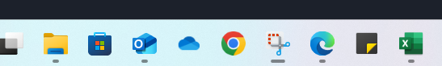

## GESTOR DE ARRANQUE

## 1.DEFINICIÓN
- Es un programa que se ejecuta cuando enciendes un dispositivo, justo después de que el sistema realiza las pruebas de hardware inciales. Y carga el sistema operativo en la memoria para que pueda ejecutarse.
- Se almacena en la placa base o en la memoria junto a la BIOS.
- EJEMPLOS:
    - GRUB(GRand Unified Bootloader): Común en Sistemas de Linux
    - Lilo (Linux Loader)
    - Windows Boot Manager
    - rEFInd: Utilizado en sistemas con configuaración dual o multiple: como macOS y Linux.

## 2.CARACTERÍSTICAS
- Selección de sistemas Operativos.
    Si tienes distintos sistemas operativos instalados, este te permite elegir cuál deseas arrancar.

- Configuración y personalización.
    Puedes configurarlo para modificar parámetros, como el tiempo de espera para la selección del sistema operativo o los modos de arranque.

## 3.¿CÓMO FUNCIONA EL PROCESO DE ARRANQUE?
1. Encendido del hardware:
    La BIOS o UEFI verifica y configura el hardware.
2. Transferencia al gestor de arranque:
    La BIOS/UEFI busca el gestor de arranque en el sector de inicio del disco duro o SSD.
3. Gestión por el bootloader:
    El gestor de arranque toma el control y carga el sistema operativo seleccionado en la RAM.
4. Inicio del sistema operativo:
    El sistema operativo comienza a ejecutarse.

## 4.CONCLUSIÓN
El gestor de arranque es el puente que conecta el Hardaware de un dispotivo con el sistema operativo, asegurando que el proceso de arranque sea eficiente y configurable.

## DIFERENCIAS DE UN BOOTLOADER EN UNA COMPUTADORA VS UN DISPOSITVO MÓVIL
MÓVIL:
- El gestor de arranque está diseñado para un sistema operativo específico. 
- Está integrado con el firmware del dispositvo y suele estar bloqueado para evitar modificaciones.
- Interfaz no visible para el usuario promedio.
- Proceso de arranque más automatizado y menos personalizable.
- Ejemplos: Android: Bootloader
            iBoot en iOS

COMPUTADORA:
- Suelen ser más flexibles y configurables.
- Soportan distintos sistemas operativos permitiendo al usuario cuál arrancar.
- Utiliza interfaces gráficas o basadas en texto que el usuario puede personalizar.

