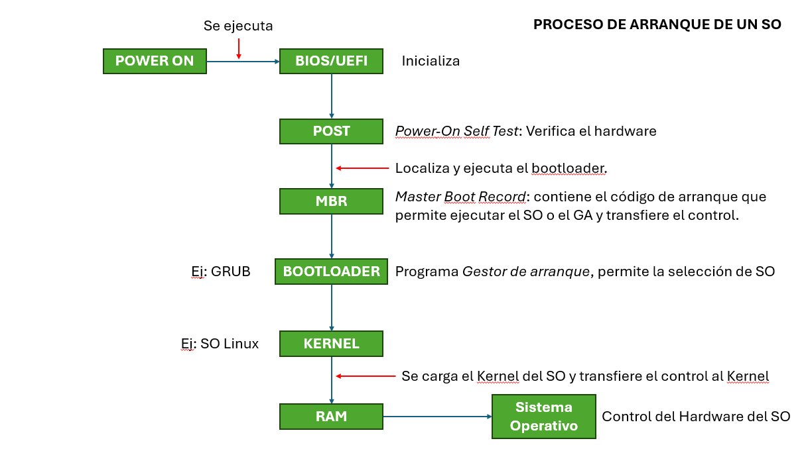

# Instalación de varios OS en un equipo.

La instalación de varios OS en un equipo es posible gracias al "Multiboot" o "Arranque múltiple", que consiste en dividir el disco duro del ordenador en varias "particiones" y luego instalar diferentes sistemas operativos en cada partición, al arrancar la computadora con doble arranque, el sistema preguntará al usuario cual de los sistemas instalados quiere utilizar, y pasada esta etapa comenzará la carga de "solo" ese sistema. cuando se hace la instalación en un disco duro con particiones es necesario reiniciar el ordenador para cambiar de un sistema operativo a otro. La capacidad de elegir el sistema a arrancar está otorgada por el Gestor de arranque (o Boot loader).
También tienes la posibilidad de virtualizar el sistema operativo desde el propio Windows y así poder trabajar con dos sistemas operativos a la vez, sin tener que reiniciar.

## Aquí tienes los pasos generales para lograr la instalación de varios OS en un equipo:

## 1. Planificación.
- Hardware: Verifica que tu equipo tenga suficiente espacio en el disco y sea compatible con los sistemas operativos que deseas instalar.
- Sistemas Operativos: Define los sistemas que deseas instalar (Windows, Linux, macOS, etc.).
- Orden de instalación: Generalmente, instala primero Windows, ya que tiende a sobrescribir los cargadores de arranque de otros sistemas.

## 2. Crear un respaldo.
- Copia de seguridad: Haz un respaldo completo de tus datos importantes para evitar pérdidas durante la instalación.

## 3. Preparar el disco.
- Particiones: Utiliza herramientas como el Administrador de discos de Windows, GParted (Linux), o un software de terceros.
- Crea una partición para cada sistema operativo: Asegúrate de reservar espacio suficiente para cada OS y sus datos.

## 4. Instalar los sistemas operativos.

### Instalar Windows:
- Inserta el medio de instalación de Windows (USB/DVD).
- Sigue el proceso de instalación y selecciona la partición destinada para Windows.
- Completa la instalación.

### Instalar Linux:
- Inserta el medio de instalación de Linux.
- Durante la instalación, selecciona la opción "Instalar junto a otro sistema operativo" o elige la partición manualmente.
- Instala el gestor de arranque GRUB, que detectará automáticamente Windows.

### Instalar macOS (opción más compleja, solo en hardware compatible):
- Requiere hardware de Apple o hackintosh.
- Sigue los pasos específicos para tu hardware.

## 5. Configurar el gestor de arranque.
- GRUB (Linux): Si instalaste Linux, este gestor de arranque detectará todos los sistemas operativos.
- Herramientas adicionales:
- EasyBCD (Windows) para configurar el arranque.
- rEFInd para sistemas EFI/UEFI.
- Personaliza el orden de los sistemas y el tiempo de espera.

## 6. Verificación.
- Reinicia el equipo y prueba iniciar en cada sistema operativo.
- Si algo no funciona, usa un disco de recuperación o reinstala el gestor de arranque.

## GESTOR DE ARRANQUE

## 1.DEFINICIÓN
- Es un programa que se ejecuta cuando enciendes un dispositivo, justo después de que el sistema realiza las pruebas de hardware inciales. Y carga el sistema operativo en la memoria para que pueda ejecutarse.
- Se almacena en la placa base o en la memoria junto a la BIOS.
- EJEMPLOS:
    - GRUB(GRand Unified Bootloader): Común en Sistemas de Linux
    - Lilo (Linux Loader)
    - Windows Boot Manager
    - rEFInd: Utilizado en sistemas con configuaración dual o multiple: como macOS y Linux.

## 2.CARACTERÍSTICAS
- Selección de sistemas Operativos.
    Si tienes distintos sistemas operativos instalados, este te permite elegir cuál deseas arrancar.

- Configuración y personalización.
    Puedes configurarlo para modificar parámetros, como el tiempo de espera para la selección del sistema operativo o los modos de arranque.

## 3.¿CÓMO FUNCIONA EL PROCESO DE ARRANQUE?
1. Encendido del hardware:
    La BIOS o UEFI verifica y configura el hardware.
2. Transferencia al gestor de arranque:
    La BIOS/UEFI busca el gestor de arranque en el sector de inicio del disco duro o SSD.
3. Gestión por el bootloader:
    El gestor de arranque toma el control y carga el sistema operativo seleccionado en la RAM.
4. Inicio del sistema operativo:
    El sistema operativo comienza a ejecutarse.

## 4.CONCLUSIÓN
El gestor de arranque es el puente que conecta el Hardaware de un dispotivo con el sistema operativo, asegurando que el proceso de arranque sea eficiente y configurable.

## DIFERENCIAS DE UN BOOTLOADER EN UNA COMPUTADORA VS UN DISPOSITVO MÓVIL
MÓVIL:
- El gestor de arranque está diseñado para un sistema operativo específico. 
- Está integrado con el firmware del dispositvo y suele estar bloqueado para evitar modificaciones.
- Interfaz no visible para el usuario promedio.
- Proceso de arranque más automatizado y menos personalizable.
- Ejemplos: Android: Bootloader
            iBoot en iOS

COMPUTADORA:
- Suelen ser más flexibles y configurables.
- Soportan distintos sistemas operativos permitiendo al usuario cuál arrancar.
- Utiliza interfaces gráficas o basadas en texto que el usuario puede personalizar.

